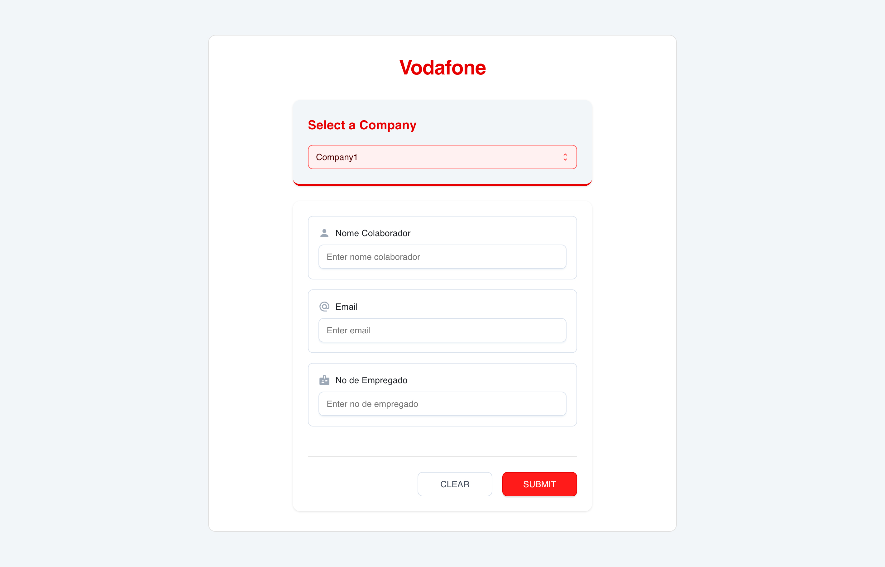

# 🧾 Dynamic Form Generator

> A modern React application that generates dynamic forms with real-time validation and a clean UI.

<div align="center">
  
</div>

## 🌟 Overview

This project showcases a dynamic form generation system built with React, TypeScript, and Material-UI. It demonstrates modern web development practices and clean architecture principles.

## 🛠️ Technologies Used

- **React 18** - JavaScript library for building user interfaces
- **TypeScript** - Static typing for JavaScript
- **Material-UI** - React UI component library
- **Vite** - Next-generation frontend tooling
- **Styled Components** - CSS-in-JS styling
- **ESLint** - JavaScript linting utility
- **Prettier** - Code formatter
- **Jest** - Testing framework

## 🏗️ Architecture

The application follows a component-based architecture with these key features:

- 🔄 Dynamic form generation from JSON configuration
- 🎨 Reusable UI components with consistent styling
- ✨ Real-time form validation
- 🔌 Pluggable company configurations

### Key Components

```
📁 public/
├── 📄 image.jpg
📁 src/
├── 📁 components/
│   ├── 📁 Select/           # Reusable select component
│   ├── 📁 FormGenerator/    # Dynamic form renderer
│   └── 📁 CompanySelector/  # Company selection handling
├── 📁 styles/
│   └── 📄 theme.ts         # Global styling and theming
├── 📁 utils/
│   └── 📄 validation.ts    # Form validation utilities
└── 📁 config/
    └── 📄 companies.json   # Company configurations
```

## 🧩 Design Patterns & Best Practices

### SOLID Principles
- **Single Responsibility**: Each component has one specific purpose
- **Open/Closed**: Easy to extend with new form fields without modifying existing code
- **Interface Segregation**: Components accept only the props they need
- **Dependency Inversion**: Components depend on abstractions, not concrete implementations

### React Best Practices
- 🔄 Controlled components for form handling
- 🎣 Custom hooks for business logic
- 🏷️ TypeScript for type safety
- 🎨 Styled components for maintainable CSS
- 📝 Prop validation using TypeScript interfaces

## 🚀 Getting Started

1. **Clone & Install**
```bash
git clone https://github.com/augustodellafina/dynamic-form-app.git
cd dynamic-form-app
npm install
```

2. **Development**
```bash
npm run dev
```

3. **Building**
```bash
npm run build
```

## 💡 Features

### Form Generation
- 📝 Dynamic field generation
- 🔍 Real-time validation
- 🎨 Consistent styling
- 📱 Responsive design

### Validation Rules
- ✉️ Email format validation
- 🔒 Required field checking
- 📏 Length validation
- 🎯 Pattern matching

### UI Components
- 🔄 Custom Select component
- 📝 Input fields with icons
- 📋 Textareas
- 🚨 Error messages
- ✅ Success notifications

## 📈 Future Improvements

- [ ] Add more field types
- [ ] Implement field dependencies
- [ ] Add form state persistence
- [ ] Create form templates
- [ ] Add animation effects

## 🤝 Contributing

Contributions are welcome! Please feel free to submit a Pull Request.

## 📝 License

This project is licensed under the MIT License

---

Made with ❤️ by Augusto Dellafina 👑
